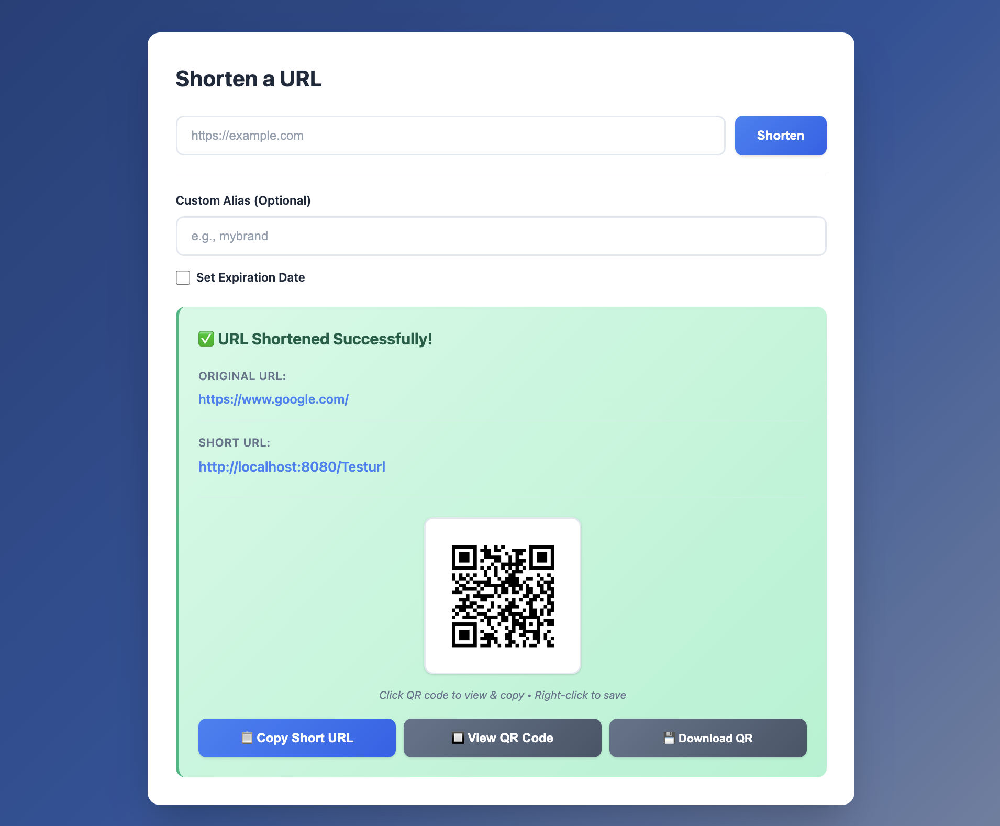
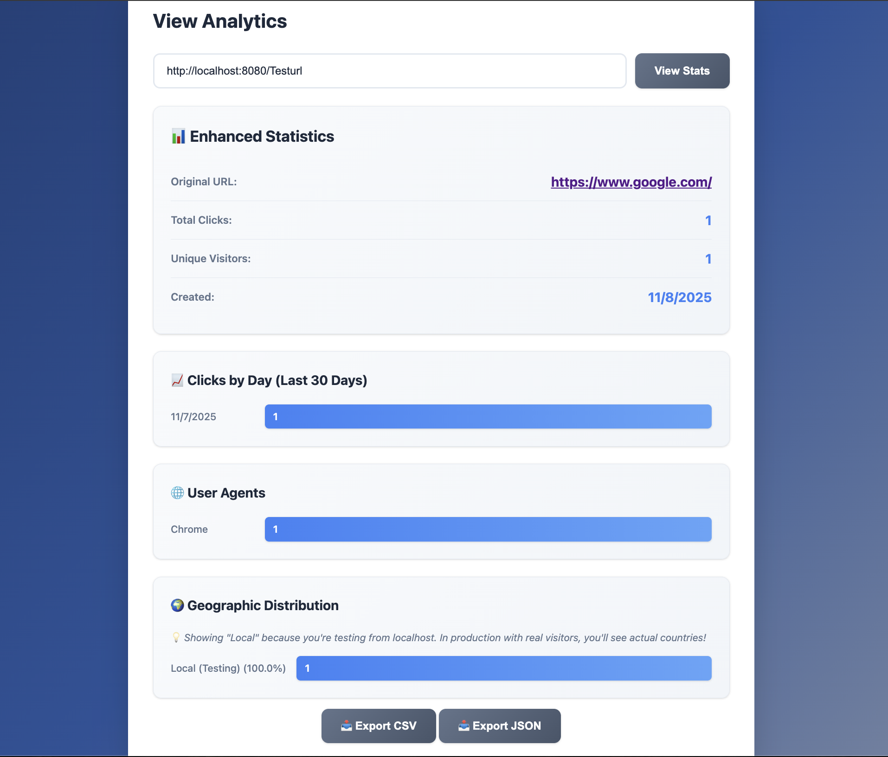

# 🔗 GOURL - Advanced URL Shortener

<div align="center">


**A modern, self-hostable URL shortener with analytics built with Go**

[Features](#-features) • [Quick Start](#-quick-start) • [Deployment](#-deployment) • [API](#-api-documentation) • [Contributing](#-contributing)

</div>

---

## 📸 Screenshots

### URL Shortening Interface


*Clean, modern interface for shortening URLs with custom aliases, expiration dates, and QR code generation*

### Analytics Dashboard


*Comprehensive analytics with geographic distribution, click tracking, and export options*

> **Note:** Add your screenshots to `docs/screenshots/` directory and update the paths above.

---

## ✨ Features

### Core Features
- ✅ **URL Shortening** - Create short URLs with custom aliases
- ✅ **QR Code Generation** - Automatic QR codes for every shortened URL
- ✅ **URL Expiration** - Set expiration dates for temporary links
- ✅ **Bulk Shortening** - Shorten multiple URLs in one request
- ✅ **Analytics Dashboard** - Track clicks, unique visitors, referrers
- ✅ **Geographic Analytics** - See where your clicks come from
- ✅ **Export Analytics** - Download stats as CSV or JSON

### Advanced Features
- 🔐 **JWT Authentication** - Secure user accounts and API access
- 👤 **User Dashboard** - Manage all your URLs in one place
- 🌙 **Dark Mode** - Beautiful dark/light theme toggle
- 📊 **Enhanced Analytics** - Daily clicks, top referrers, user agents
- 🚦 **Rate Limiting** - Protect your API from abuse
- 🔒 **CORS Support** - Cross-origin requests configured
- 🐳 **Docker Ready** - Deploy with Docker or Docker Compose
- ☁️ **Vercel Ready** - One-click deployment to Vercel

### Database Support
- 🗄️ **PostgreSQL** - Production-ready (Vercel, Railway, Render)
- 💾 **SQLite** - Perfect for local development

---

## 🚀 Quick Start

### Prerequisites
- Go 1.24+ installed
- SQLite3 (for local development) or PostgreSQL (for production)

### Installation

```bash
# Clone the repository
git clone https://github.com/kabirrgrover/gourl-public.git
cd gourl-public

# Install dependencies
go mod download

# Run the server
go run cmd/server/main.go
```

The server will start on `http://localhost:8080`

### Using Docker

```bash
# Using Docker Compose (recommended)
docker-compose up -d

# Or using Docker directly
docker build -t gourl .
docker run -p 8080:8080 gourl
```

---

## 📖 Usage

### Web Interface

1. Open `http://localhost:8080` in your browser
2. Enter a URL to shorten
3. Optionally set a custom alias or expiration date
4. View analytics by entering the short code

### API Examples

**Create a Short URL:**
```bash
curl -X POST http://localhost:8080/api/shorten \
  -H "Content-Type: application/json" \
  -d '{"url": "https://example.com", "custom_code": "mybrand"}'
```

**Get Analytics:**
```bash
curl http://localhost:8080/api/stats/{code}/enhanced
```

**Bulk Shortening:**
```bash
curl -X POST http://localhost:8080/api/shorten/bulk \
  -H "Content-Type: application/json" \
  -d '{"urls": [{"url": "https://google.com"}, {"url": "https://github.com"}]}'
```

**Get QR Code:**
```bash
curl http://localhost:8080/api/qr/{code}?size=300
```

---

## 🌐 Deployment

### Vercel (Recommended)

1. **Push to GitHub:**
   ```bash
   git push origin main
   ```

2. **Import to Vercel:**
   - Go to [vercel.com](https://vercel.com)
   - Click "New Project" → Import from GitHub
   - Select your repository

3. **Create Database:**
   - Go to Storage → Create Database → Neon (Postgres)
   - Vercel will auto-set `DATABASE_URL`

4. **Set Environment Variables:**
   ```
   JWT_SECRET=<generate with: openssl rand -hex 32>
   ENV=production
   BASE_URL=https://your-app.vercel.app
   CORS_ALLOWED_ORIGINS=https://your-app.vercel.app
   ```

5. **Deploy!** 🎉

See [DEPLOY_NOW.md](./DEPLOY_NOW.md) for detailed Vercel instructions.

### Other Platforms

- **Railway**: See [DEPLOYMENT.md](./DEPLOYMENT.md)
- **Render**: See [DEPLOYMENT_RENDER.md](./DEPLOYMENT_RENDER.md)
- **Fly.io**: See [DEPLOYMENT_FLY.md](./DEPLOYMENT_FLY.md)

---

## 🔧 Configuration

Environment variables:

| Variable | Description | Default |
|----------|-------------|---------|
| `PORT` | Server port | `8080` |
| `DATABASE_URL` | PostgreSQL connection string | (uses SQLite) |
| `POSTGRES_URL` | Alternative PostgreSQL URL | (uses SQLite) |
| `DB_PATH` | SQLite database path | `gourl.db` |
| `ENV` | Environment mode | `development` |
| `JWT_SECRET` | JWT signing secret | (dev key) |
| `BASE_URL` | Base URL for short links | (auto-detect) |
| `CORS_ALLOWED_ORIGINS` | Allowed CORS origins | `*` |
| `RATE_LIMIT_RPS` | Rate limit (requests/sec) | `10` |
| `RATE_LIMIT_BURST` | Rate limit burst size | `20` |

---

## 📚 API Documentation

### Public Endpoints

- `POST /api/shorten` - Create short URL
- `POST /api/shorten/bulk` - Bulk shorten URLs
- `GET /api/stats/:code` - Get basic stats
- `GET /api/stats/:code/enhanced` - Get enhanced stats
- `GET /api/qr/:code` - Get QR code image
- `GET /:code` - Redirect to original URL

### Authentication Endpoints

- `POST /api/auth/register` - Register new user
- `POST /api/auth/login` - Login and get JWT token

### Protected Endpoints (Require JWT)

- `GET /api/my-urls` - List user's URLs
- `GET /api/urls/:code` - Get URL details
- `DELETE /api/urls/:code` - Delete URL

See [API Documentation](./API.md) for detailed examples.

---

## 🏗️ Project Structure

```
gourl/
├── api/
│   └── index.go              # Vercel serverless handler
├── cmd/
│   └── server/
│       └── main.go           # Application entry point
├── pkg/
│   ├── handlers/             # HTTP handlers
│   ├── models/               # Data models
│   ├── database/            # Database setup
│   ├── middleware/           # Middleware (CORS, rate limiting)
│   ├── config/               # Configuration
│   ├── auth/                 # JWT authentication
│   └── utils/                # Utilities (code gen, geolocation)
├── web/
│   └── static/               # Frontend (HTML, CSS, JS)
├── Dockerfile
├── docker-compose.yml
├── vercel.json               # Vercel configuration
└── go.mod
```

---

## 🛠️ Development

### Makefile Commands

```bash
make help          # Show all commands
make build         # Build the application
make run           # Run the application
make test          # Run tests
make docker-build  # Build Docker image
make docker-run    # Run with Docker Compose
make clean         # Clean build artifacts
```

### Running Locally

```bash
# Development mode
make dev

# Production mode
make prod

# With custom config
PORT=3000 ENV=production go run cmd/server/main.go
```

---

## 🤝 Contributing

Contributions are welcome! Please feel free to submit a Pull Request.

1. Fork the repository
2. Create your feature branch (`git checkout -b feature/AmazingFeature`)
3. Commit your changes (`git commit -m 'Add some AmazingFeature'`)
4. Push to the branch (`git push origin feature/AmazingFeature`)
5. Open a Pull Request

### Development Guidelines

- Follow Go code style guidelines
- Add tests for new features
- Update documentation as needed
- Keep commits clean and descriptive

---

## 📝 License

This project is licensed under the MIT License - see the [LICENSE](LICENSE) file for details.

---

## 🙏 Acknowledgments

- Built with [Gin](https://github.com/gin-gonic/gin) web framework
- QR code generation with [go-qrcode](https://github.com/skip2/go-qrcode)
- Inspired by Bitly and other URL shorteners

---

## ⭐ Show Your Support

If you find this project useful, please give it a ⭐ on GitHub!

---

<div align="center">

**Made with ❤️ using Go**

[Report Bug](https://github.com/kabirrgrover/gourl-public/issues) • [Request Feature](https://github.com/kabirrgrover/gourl-public/issues) • [Documentation](./README.md)

</div>
